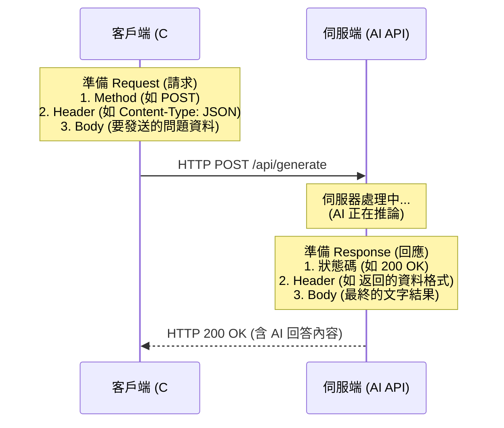
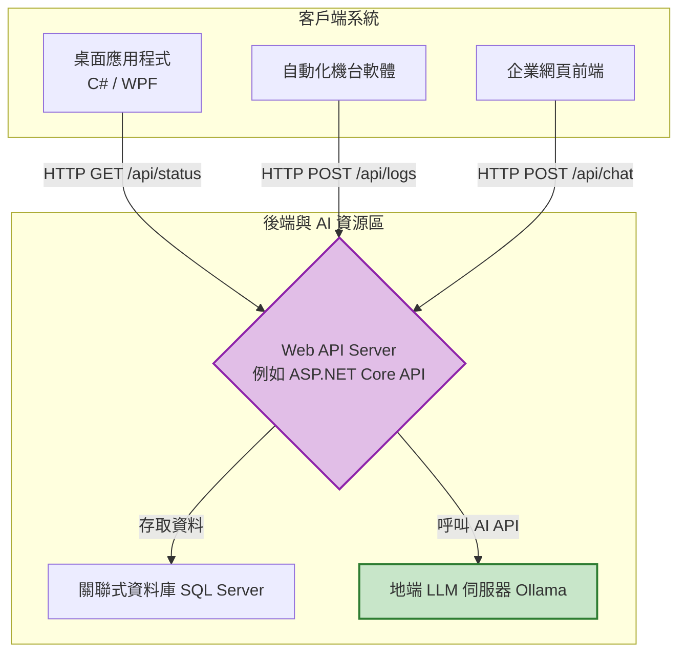
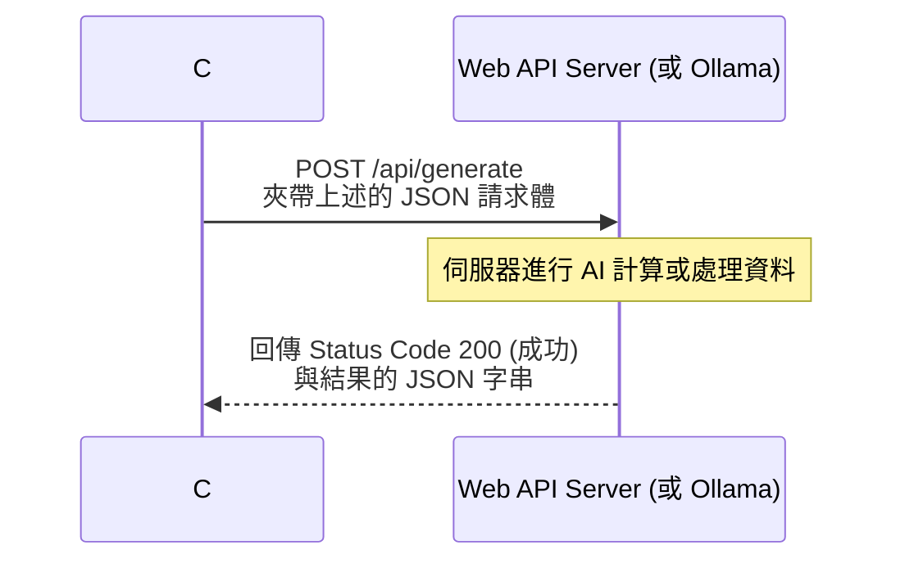

# Appendix｜Web 基礎知識與 Web API 運作說明

對於部分熟悉企業內網封閉系統或傳統桌面應用程式 (Windows Form/WPF) 開發的 IT 工程師，剛接觸 AI 整合時可能會對 Web API 感到陌生。

這個附錄會簡單且快速地說明現代 Web 架構的基礎，幫助您銜接前幾個 Session 關於串接 AI 的實作。

## 1. Web 系統基礎傳輸架構：HTTP 協定

網際網路（包含您公司的內網 intranet）中最常見的溝通語言，叫做 **HTTP (HyperText Transfer Protocol)**。這是一套標準化的規則，規定了任何兩台電腦之間該怎麼一問一答。

您可以把它想像成去去餐廳點餐的完整流程：
- **Client (客戶端)：** 負責點餐的客人（可能是您的 C# 程式、瀏覽器，或是產線上的機台軟體）。
- **Request (請求)：** 您填好的點餐單。單子上除了寫「要什麼菜 (內容)」，還會註明「您坐哪桌 (標頭 Header)」。
- **Server (伺服端)：** 負責接單的廚房（例如我們架設的地端 Ollama AI 伺服器）。
- **Response (回應)：** 廚房做好的餐點，以及由店員回報的一句「您的餐好了 (狀態碼 200)」。

### HTTP Request 與 Response 核心結構解剖

一個完整的 HTTP 溝通會包含「請求訊息」與「回應訊息」，每種訊息通常有兩個重要部分：**Header (標頭)** 放控制資訊，**Body (內容)** 放實際的資料。



### 常見 HTTP 方法 (Method) 與 狀態碼 (Status Code)

我們使用不同的「動詞 (Method)」來要求主機做不同的事：
* `GET`：單純地取得資料（像是在網頁看新聞，不會改變系統狀態）。
* `POST`：新增資料或請求伺服器進行大量運算（**我們呼叫 AI 最常用的方法，把很長的問題包裝在 Body 裡丟出去**）。
* `PUT` / `PATCH`：更新既有的資料。
* `DELETE`：刪除資料。

當伺服器處理完畢後，會回傳 **狀態碼 (Status Code)** 讓您的程式知道結果：
* `200 OK`：一切順利，資料在 Body 裡請查收。
* `400 Bad Request`：您的點餐單寫錯了 (例如 JSON 格式錯誤)，廚房看不懂。
* `404 Not Found`：找不到您要的服務 (您可能把 API 網址打錯了)。
* `500 Server Error`：廚房失火了 (AI 伺服器內部發生異常崩潰)。

## 2. 什麼是 Web API？什麼是 RESTful API？

**API (Application Programming Interface, 應用程式介面)** 是軟體之間溝通的橋樑。當加了 **Web** 前綴，就代表這個橋樑是建立在網際網路或您的企業內網之上。

您可以把 API 想像成銀行的「櫃台服務人員」：
即使您不知道金庫密碼，也不知道銀行內部怎麼記帳的（就像您不知道 AI 模型背後複雜的神經網路怎麼算出來的），只要您填好**匯款單 (Request)**，交給正確的**櫃台 (API 端點)**，服務人員處理完後就會把**收據 (Response)** 交給您。

### RESTful API 的設計風格

**REST (Representational State Transfer)** 是目前 Web API 最主流的設計風格。它的核心概念是「**把所有事物都看作一種資源 (Resource)**」，並且給每個資源一個明確的**網址 (URL)**，搭配我們前面提到的 HTTP 動詞來操作它。

這與傳統呼叫本地端 Function (`GetUserData(123)`) 的思維有很大的不同。在 RESTful 架構下，API 會長得像這樣：
- `GET /api/machines/E-03`：取得 E-03 機台的狀態資料。
- `POST /api/machines/E-03/commands`：發送一條控制指令給 E-03 機台。
- `POST http://localhost:11434/api/generate`：(我們用到的大型語言模型) 送出一段文字，請求 AI 生成文字資源。

而且發送請求後，不需要像開發傳統桌面應用程式一樣維持常態的 TCP 連線 (如 WebSocket 或 Socket)。RESTful Web API 的精神通常是「一期一會」：**「請求發出 -> 伺服器運算 -> 拿到結果 -> 結束並切斷互動」**（這稱為無狀態 Stateless 請求）。

#### Web API 運作架構概念圖



## 3. JSON：現代資料交換的標準格式
早期系統常使用 XML 交換資料。而在現代 Web API 開發，主流使用的是 **JSON (JavaScript Object Notation)** 格式。
它的特色在於以鍵與值 (Key-Value) 成對出現，機器好解析，人類也勉強能看懂。

範例，我們要求 LLM 產生的 JSON 格式：
```json
{
  "model": "llama3",
  "prompt": "請問感測器有問題怎麼辦？",
  "stream": false
}
```



## Recap 總結
1. AI 模型的部署最終都會包裝成 Web API 來提供服務，因此掌握 HTTP Request 技能是整合 AI 的第一步。
2. 現代 API 中，不管雙方的程式語言為何（Python, C#, Java），通常統一採用 JSON 格式進行資料的打包與傳遞。

在 `examples/SimpleWebAPI.cs` 之中，我們展示了如果您要在自己的電腦上，使用 C# 建立一個簡單接收其他人呼叫的 API 端點，程式碼可以多麼簡潔。
