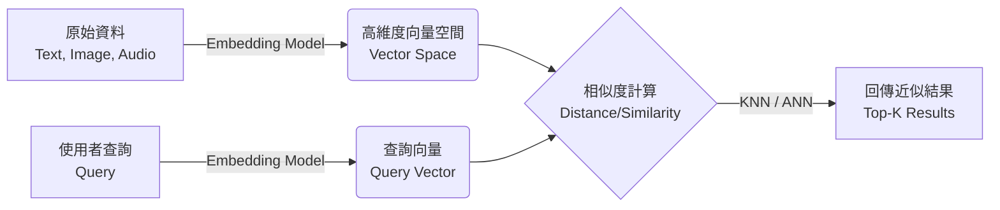
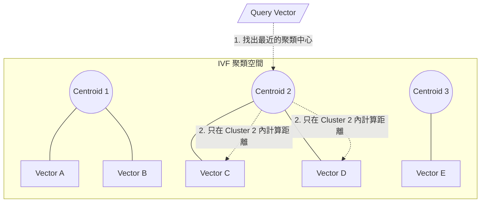
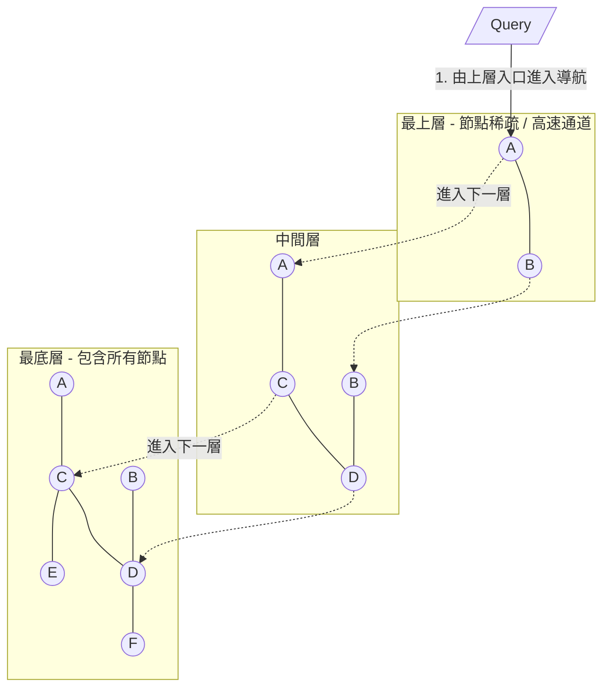
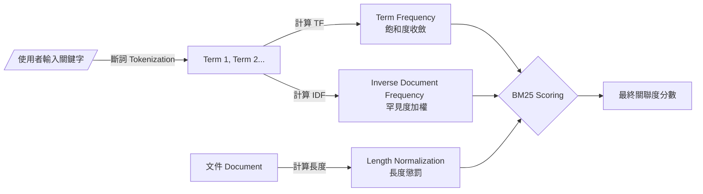
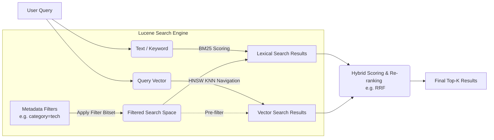

# Vector Search 基本原理與常見演算法介紹

## 1. Vector Search (向量搜尋) 基本原理

向量搜尋是一種基於機器學習模型（如神經網路）將非結構化資料（文字、圖片、音訊等）轉換為高維度數值向量（Embeddings）的技術。藉由計算空間中向量之間的幾何距離或相似度，來找出「語意」上最相近的資料，而不僅僅是進行字面上的關鍵字比對。

### 核心概念與流程

### 常見的相似度計算方式 (Distance Metrics)

1. **Cosine Similarity (餘弦相似度)**: 計算兩個向量夾角的餘弦值，與向量長度無關，常應用於自然語言處理。
2. **Euclidean Distance (歐式距離, L2)**: 計算兩個向量點在空間中的直線距離。
3. **Dot Product (內積)**: 考慮向量長度與夾角，當所有向量都做過正規化 (Normalized) 後，其結果會正比於餘弦相似度。

---

## 2. 近似最近鄰搜尋 (ANN - Approximate Nearest Neighbor)

在大規模資料集中，若要把查詢向量與資料庫中所有的向量一一比對計算距離（Exact Nearest Neighbor, KNN），會消耗極大的運算資源與時間（O(N) 複雜度）。因此，實務上通常採用 **ANN** 演算法，在「精準度」與「搜尋速度」之間取得平衡。

主流的 ANN 演算法包括 **IVF** 與 **HNSW**：

### 2.1 IVF (Inverted File Index - 倒排檔案索引)

IVF 把原本龐大的向量空間，透過分群演算法（如 K-Means）劃分成多個聚類（Clusters/Voronoi Cells），每個聚類有一個中心點（Centroid）。搜尋時，只需先找出與查詢向量最接近的少數幾個聚類中心，然後只在這些選定的聚類內部進行搜尋，藉此大幅縮小比對範圍。

- **優點**：記憶體佔用較少，建立索引較為快速。
- **缺點**：在高維度時，叢集邊界容易發生重疊現象，如果目標向量剛好在叢集邊界上，可能會導致找不到正確解答（影響精準度）。通常會搭配 PQ (Product Quantization) 來進一步壓縮向量。

### 2.2 HNSW (Hierarchical Navigable Small World)

HNSW 是一種基於圖論 (Graph-based) 的演算法，基於 Navigable Small World (NSW) 改進而來，是目前最受歡迎且效能極佳的 ANN 演算法之一。它建構了類似「跳表 (Skip List)」的多層次圖結構：

- **高層圖**：節點數少，隨機抽取部分節點建立較稀疏的連線（類似高速公路），負責大範圍快速定位。
- **底層圖**：包含所有的資料節點，節點間連線密集，負責精確尋找局部最佳解。

搜尋時從最上層的入口點開始走訪，在該層找到最近相鄰節點後，將該節點作為下一層的起點往下潛，直到抵達底層的精確位置。

- **優點**：搜尋速度極快，精準度（Recall rate）非常高，實務表現優異。
- **缺點**：因為要維護大量的圖表節點連線關係 (Edges)，會消耗龐大的記憶體容量，且建立索引的過程較為耗時。

---

## 3. 傳統全文檢索與 BM25 演算法 (Lexical Search)

在探討與向量結合的混合搜尋之前，必須先了解傳統基於關鍵字比對的 Lexical Search。在評估一份文件與關鍵字搜尋的相關程度時，業界最廣泛採用的評分演算法即是 **BM25 (Best Matching 25)**。

### 核心概念與計算考量

BM25 可以被視為傳統 TF-IDF 演算法的改良版。它在計算相關性分數時，主要考量以下三大因素：

1. **詞頻 (Term Frequency, TF) 與飽和度收斂**：
   - 該關鍵字在文件中出現的次數。出現越多越相關，但 BM25 對 TF 導入了「上限（Saturation）」的概念，避免單一關鍵字瘋狂重複導致分數無限制往上疊加。
2. **逆文件頻率 (Inverse Document Frequency, IDF) - 罕見度加權**：
   - 該關鍵字在整個語料庫（所有文件）裡的罕見程度。越罕見的詞（例如專有名詞）被給予越高的權重；越常見的詞（例如 "的", "是", "the"）權重越低。
3. **文件長度正規化 (Document Length Normalization) - 長度懲罰**：
   - 長篇文件可能只是因為字數多而自然包含該關鍵字，因此 BM25 會將文件長度納入考量。如果一份文件比平均長度還要長，會適當降低它的詞頻影響力，以確保短而精確且聚焦的主題文件能獲得合理的排名。

- **優點**：對於精確的關鍵字匹配（如料號、人名、精確術語、特定型號）效果極佳，硬體資源開銷小且計算速度極快。
- **缺點**：無法理解同義詞或上下文語意（例如搜尋「智慧型手機」，可能根本找不到內容只有「iPhone 14」的文件）。這也是為什麼現代系統會引入能理解語意的**向量搜尋**與之互補。

---

## 4. Apache Lucene 系統內的向量搜尋

Apache Lucene 是一個廣泛使用的開源全文字搜尋引擎工具包（也是 Elasticsearch 與 OpenSearch 等知名搜尋引擎的底層核心）。在 Lucene 9.0 之後的版本，它原生支援了稠密向量搜尋 (Dense Vector Search)。

### Lucene 向量搜尋的關鍵特點

1. **原生 HNSW 實作**：
   Lucene 內部實作了 HNSW 來建立向量的索引。當有包含高維度向量的 Document 寫入 Lucene 時，Lucene 會一併在底層建構和更新 HNSW 圖。

2. **混合搜尋 (Hybrid Search)**：
   Lucene 最強大的優勢在於能將傳統的 Lexical Search（基於關鍵字、詞頻的 BM25 演算法）與 Vector Search 完美結合。使用者可以在同一次查詢中，同時進行精確的比對與語意搜尋。之後再透過如 Reciprocal Rank Fusion (RRF) 或線性加權的方式將兩份結果重新排序 (Re-ranking) 選出綜合最相關的結果。

3. **強大的過濾器 (Filters) 整合**：
   單純的向量資料庫在做屬性過濾時較具挑戰性，而 Lucene 可以利用其傳統強大的位元組陣列表示法（Bitsets）做極快的 Pre-filtering 或 Post-filtering。在使用 HNSW 導航前先套用條件（如過濾「價格低於 100 且在庫存中」的商品），能確保找出的最近鄰必定符合這些業務邏輯過濾條件。

### 總結

Vector Search 透過 Embeddings 與向量空間概念，將搜尋技術提升至能夠理解「語意」的維度。在實際應用中，為了兼顧效能與精確度而發展出了 IVF 與 HNSW 等 ANN 結構；而結合傳統全文檢索巨頭如 Lucene 的混合搜尋方案（Hybrid Search + Metadata Filtering），則是許多現代大型 AI 搜尋應用的主流選擇。
