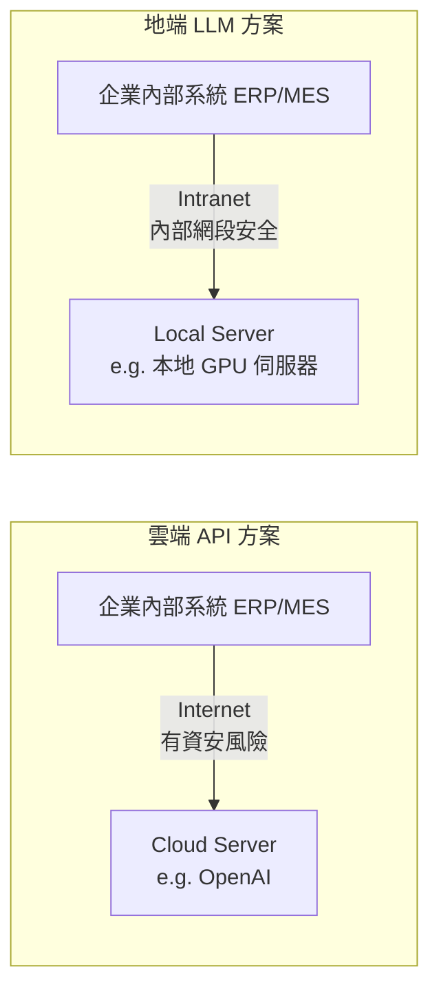
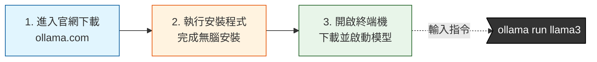
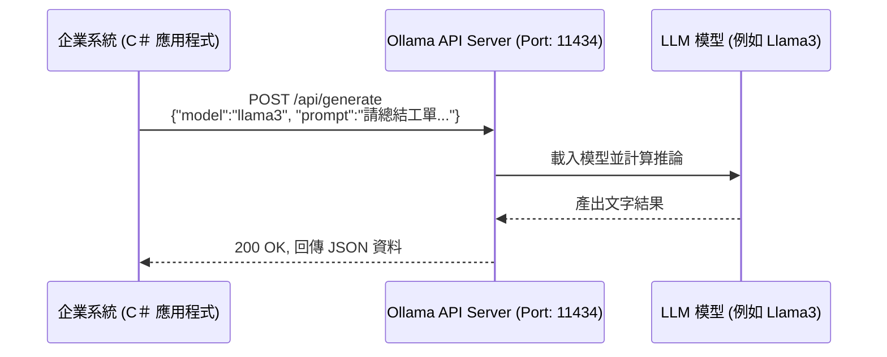
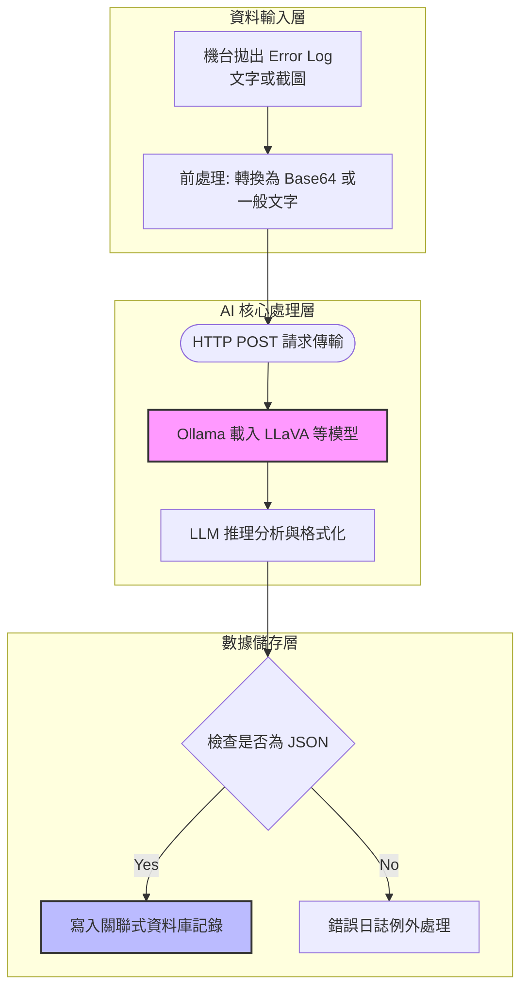

# Session 1｜地端 LLM 部署與企業系統 API 整合

歡迎來到第一個 Session！這個單元的目標，是讓我們具備在工廠或企業內部安全部署開源 AI 模型的能力，並且將其包裝成熟悉且容易呼叫的 Web API，讓既有的 ERP、MES 或是機台系統能夠輕鬆介接。

## 1. LLM 基礎觀念與邊緣運算優勢

作為 IT 開發人員，您可能會問：「為什麼我們不直接呼叫 OpenAI (ChatGPT) 就好？」

在部分企業場景中，商業 API 確實方便，但當我們面對：
- **機密保護**：設備參數、工單資料或客戶機密絕不能離開公司內部網路。
- **斷網可用性**：工廠機台在封閉網路中，不一定有穩定對外連線。

這時，我們就需要 **Local LLM（地端大型語言模型）**，將 AI 運算帶到離資料與機台最近的地方（邊緣運算 Edge Computing）。

### 系統架構：雲端 vs. 地端 LLM



### 硬體評估：要多少資源才能跑？
要在工廠端運行模型，我們需要考量關鍵的硬體資源：**VRAM (顯示卡記憶體)** 與 **算力 (GPU)**。
一般來說，參數越大的模型越聰明，但也需要越大的記憶體。舉例來說：
- 8B (80 億參數) 級別模型（如 Llama 3 8B），大約需要 6~8GB 以上的 VRAM。
- 30B (300 億參數) 級別，則可能需要 24GB 以上的 VRAM。

---

## 2. Ollama 部署與 Web API 實戰

要在原本我們熟悉的伺服器環境中跑 LLM，最簡單的工具之一就是 **Ollama**。它把龐大複雜的模型執行環境包裝得像普通的服務一樣，並且**自帶一個 RESTful API 介面**！對我們熟悉 Web API 的工程師來說，這意味著我們不需要寫艱深的 Python PyTorch 程式，只要發送 HTTP Request 就能獲得 AI 產生結果。

### Ollama 簡易安裝與啟動

將 AI 部署到您的電腦上只需三個簡單步驟：



1. **下載**：前往 [Ollama 官方網站](https://ollama.com/) 點擊 Download，支援 Windows / macOS / Linux。
2. **安裝**：如同一般應用程式般執行安裝檔。安裝完成後，Ollama 會在背景執行一個 API 伺服器 (預設佔用 `11434` Port)。
3. **啟動**：打開您的 命令提示字元 (cmd) 或 PowerShell，輸入以下指令來下載並執行您的第一個模型（例如 80 億參數的 Llama 3）：
   ```bash
   ollama run llama3
   ```
   *(註：初次執行會需要時間下載數 GB 的模型檔，下載完成後就會進入可直接對話的終端機介面。)*

### 架構解析



在範例資料夾 `examples/` 中，我們準備了一支 `OllamaBasicClient.cs` 程式，示範如何使用 C# 透過 `HttpClient` 發送請求到 Ollama，來獲得推論結果。

---

## 3. 實務應用場景：從文字到視覺 (VLM)

當我們具備了打 API 的能力後，可以做些什麼？
製造業最常見的需求之一，就是**解析機台錯誤日誌（Log）或是未結構化的工單資料**。您可以將這包文字丟給模型，要求它：「請以 JSON 格式總結這段機台發生的主要錯誤，包含機器代碼與發生時間」。

更酷的是，我們還可以運用 **VLM (Vision Language Model, 視覺語言模型)**。這代表您可以傳入一張機台報錯的圖檔或是儀表板畫面，讓 AI 去「看圖說故事」。



---

## Recap & Exercise

### 📝 Recap 總結
1. 因為資安與網路限制，製造業適合部署 Local LLM。
2. Ollama 提供封裝好的 REST API，讓我們可以使用熟悉的程式語言（如 C#）發送 HTTP Request 來呼叫 AI。
3. AI 除了讀文字（生成結構化 JSON），視覺模型 (VLM) 將有助於機台圖片判讀。

### 🏋️‍♂️ Exercise 演練
1. 請開啟您的終端機/命令提示字元，確認主機已安裝 Ollama，並且能夠啟動。
2. 開啟 `examples/OllamaBasicClient.cs`，使用 .NET SDK 建立專案並執行該範例，確認您能成功接收到由 LLM 生成的字串。
3. （進階）嘗試修改程式碼，發送一個簡單的機身錯誤代碼給模型，並強迫模型在回應中「僅回覆解決方案的三個步驟」。
