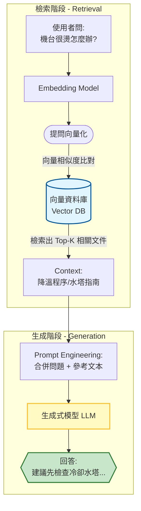
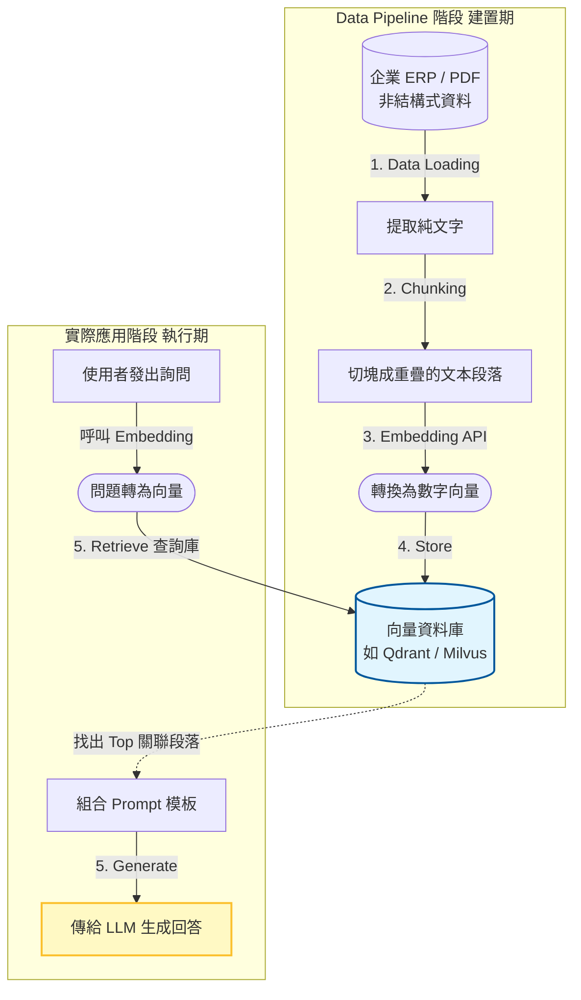
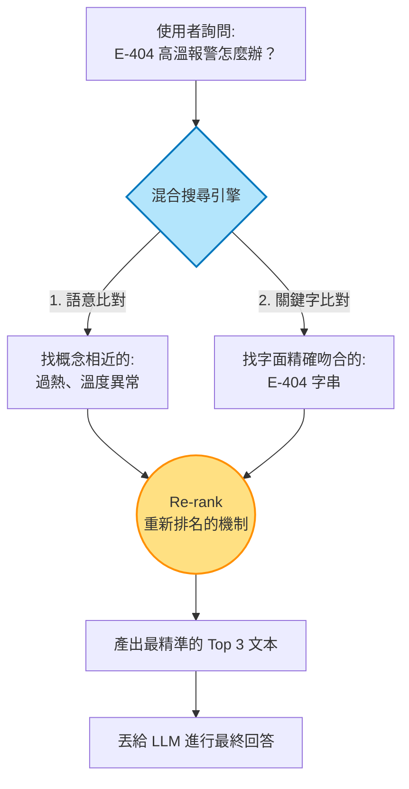

# Session 2｜RAG 私有知識庫：賦予 AI 設備領域知識

上一個單元，我們成功召喚了 LLM，但您可能會發現一個問題：「它根本不懂我們公司機台的專屬專有名詞設定！」

這是因為 LLM 使用的是外面的通用資料庫訓練。為了解決這個問題，我們需要 **RAG (Retrieval-Augmented Generation, 檢索增強生成)**，讓我們把龐大的「設備操作手冊」與「歷史維修記錄」變成 AI 能隨時查詢的專屬資料庫。

## 1. RAG 核心運作機制與架構

簡單來說，RAG 就是**讓 AI 在回答問題之前，先去翻閱我們的參考書（知識庫）**。

這分為三個核心步驟：

1. **向量化（Embedding）**：把文字語意轉換為電腦能理解的一串「數字向量」。
2. **檢索（Retrieve）**：當使用者問問題時，先把問題也轉成向量，去比對資料庫中最相似的資料。
3. **生成（Generate）**：把檢索到的資料段落，連同原本的問題，一起包裝丟給 LLM，得到精準的回答。

### 為什麼不用傳統 SQL 關聯資料庫就好？

我們熟悉的 `SELECT * FROM Logs WHERE ErrorMsg LIKE '%溫度%'` 是**字面上的精確比對**。但如果使用者問「機器很燙怎麼辦」，字面上沒有「溫度」這兩個字，SQL 就查不到。
**向量資料庫（Vector Database）** 能夠做到「語意搜尋」，也就是理解「很燙」與「溫度異常」在概念上是接近的。

---

## 2. 企業專屬知識處理實務 (Data Pipeline)

要在這套系統中放入我們的資料，首先要處理的是**非結構化資料**（例如：設備手冊 PDF，維修紀錄 Word）。這段資料處理的過程稱為 Data Pipeline。

這裡頭最關鍵的是 **文本切塊（Chunking）** 策略：
我們不能把整本千頁說明書塞給 LLM（受限於每一次呼叫有輸入長度限制，稱為 Context Window）。我們必須把說明書切成一個一個小段落。

- **實作思維**：在切塊時，我們必須注意不要破壞句子的完整性，或者特別將資料表與機台參數等內容，標註 Metadata 來協助後續過濾搜尋。

### 📌 實務建置的 5 個明確步驟

要從零在內部建置一套 RAG 系統，通常會經歷以下流程：

1. **資料準備 (Data Loading)**
   - **實作內容**：寫小程式將 PDF 操作手冊解開成純文字，或是從既有 ERP / MES 的 SQL Server 中倒出過去十年的文字維護紀錄。
2. **文本切塊 (Chunking)**
   - **實作內容**：將長篇文章依照標點符號或特定長度（例如每 500 個字元）切成多個段落。實務上會保留段落間的重疊 (Overlap) 約 50 個字，以免把一句話硬生生切斷造成語意斷裂。
3. **呼叫 Embedding 模型**
   - **實作內容**：透過 API（例如 OpenAI API 放寬權限，或是本地部署開源的 `text-embedding` 等模型），把上一步切好的數千個段落，通通轉換成「數字向量」。
4. **存入向量資料庫 (Store)**
   - **實作內容**：把「原始文字段落」加上「向量數字串」，一起寫入專門處理這類資料的資料庫（如 Qdrant, Milvus，或是熟悉 MS 體系的開發者也可以直接在 SQL Server 2022+ / PostgreSQL 透過外掛模組支援向量檢索）。
5. **實際檢索與生成 (Retrieve & Generate)**
   - **實作內容**：當收到使用者詢問，系統先以相同的 Embedding 模型把「問題」向量化，向資料庫發出 Query。拿到前 3 筆最相關的文字後，用字串拼接塞進 LLM 的 Prompt 中，最後才輸出給使用者。

---

## 3. RAG 進階優化與準確度提升

常常聽到 AI 會「發瘋」或是「一本正經地胡說八道」，這稱為**幻覺（Hallucination）**。
透過 RAG，我們能在 Prompt 中加上強制指令：「**請嚴格根據以下參考資料回答，若資料中未提及，請回答不知道**」，這是企業場景中避免 AI 亂給維修建議的最關鍵防線。

### 為什麼我們極度需要「混合搜尋 (Hybrid Search)」？

純粹的**向量語意搜尋**很聰明，能懂「高溫」等同於「很燙」。但它有個致命弱點對製造業與 IT 很不友善：**對特定料號或 Error Code 的敏銳度極差**。

👉 *情境舉例*：使用者詢問「**E-404 錯誤代碼的解決方案**」。

- **純向量搜尋的災難**：Embedding 模型認為「E-404」和「E-405」在語意上長得很像（都是錯誤代碼），最後可能會把 E-405 的解決方案當作第一名丟給你，導致工程師換錯零件！

為了確保準確率，目前企業級 RAG 實務上都會採用 **混合搜尋（Hybrid Search）**：
亦即同時執行「向量語意搜尋」與「傳統關鍵字 (如 BM25 演算法) 搜尋」，然後把兩邊找出來的結果進行**重新排名與算分 (Re-ranking)**，兼顧了語意理解與精確吻合。

---

## Recap & Exercise

### 📝 Recap 總結

1. RAG 架構透過 Embedding 技術賦予 AI 語意搜尋的能力。
2. 向量資料庫（Vector DB）處理的是「語意近似度」，有別於傳統關聯式資料庫的精確查詢。
3. 正確的 Chunking（文本切塊）以及搭配混合搜尋，能大幅減少 AI 的幻覺並提高精準度。

### 🏋️‍♂️ Exercise 演練

1. 請觀看 `examples/SimpleVectorSearch.cs` 程式碼。
2. 試著理解程式碼中如何呼叫模型將「查詢字串」與「資料庫字串」轉換為向量數字並計算距離。
3. （紙上練習）畫出一套針對貴單位「維修工單紀錄」的 RAG 資料處理與檢索流程圖草案。
