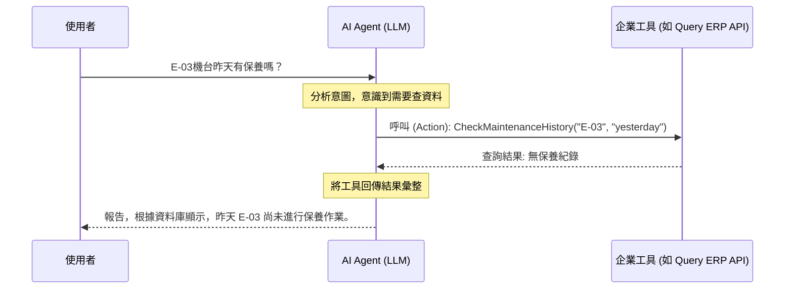
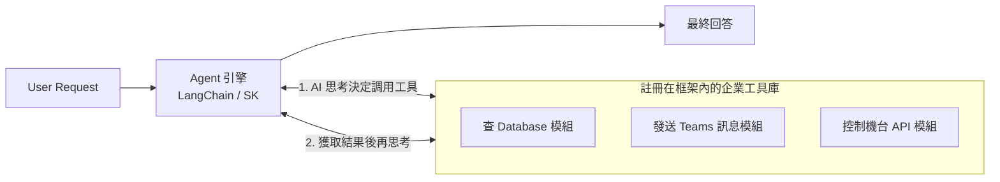
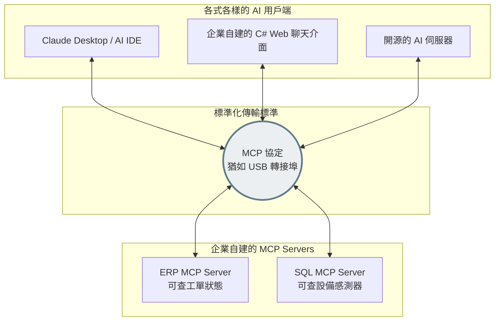

# Session 3｜AI Agent 實戰：打造製程自動化助手

經過前面單元，我們讓 AI 聽懂問題，也給了它大本的參考書 (RAG)。不過現在它還是像個只會「被動回答」的機器人。
這個單元的目標，是讓 AI 長出手腳，進化為 **AI Agent (代理人/智能體)**。它不只能文字對答，甚至會針對你的問題**主動去調用企業內部的其他工具或呼叫資料庫**！

## 1. 從 LLM 到 AI Agent 的思維躍進

什麼是 Agent？
傳統的 LLM 依賴 **提示詞驅動 (Prompt-driven)**，你輸入什麼，它就回答什麼。
但 Agent 具備 **工具調用 (Function Calling / Tool Use)** 的能力。

當你詢問 Agent：「機台 E-03 上個月維修幾次？」

1. Agent 認知到自己手邊沒有這些即時資料。
2. Agent 決定使用你預先為它準備好的「資料庫查詢工具」。
3. Agent 主動生成一個查資料庫的指令給系統。
4. 系統查完後把結果丟回給 Agent。
5. Agent 綜合整理後回報給使用者。



---

## 2. LangChain / MCP 架構與企業工具整合

### 為什麼我們需要 LangChain 等框架？

一般來說，如果您要自己寫這套「Agent 調用工具」的程式，會遇到很多麻煩的底層操作：

- 您要把公司所有的 API 寫成一長串的 JSON 敘述來跟 AI 說「我有這些工具可以用喔」。
- 您要常常解析 AI 回傳的「決定調用某工具」的 JSON 格式字串。
- 您要捕捉執行結果並把它再次黏合進歷史對話紀錄。

**LangChain** (以及 C# 開發者常用的 **Microsoft.SemanticKernel**) 這個框架的誕生，就是幫您把這些髒活 (Plumbing) 都做好了。它提供了一套標準化的「鏈 (Chain)」概念。

### 原理與運作架構：將 AI 與工具「鏈」在一起

簡單來說，在 LangChain 或 Semantic Kernel 中，我們不用從頭組裝 API Call，我們只要將模型與工具宣告出來即可。



### 👉 *實作概念範例 (以框架思維出發)*

假設您寫了一個檢查機台參數的 C# Function `CheckSensor(string machine_id)`。

透過框架，您只需要在這個函數上面加一個**裝飾器 (Attribute/Annotation)**，然後賦予它一段「人類語言的描述」，AI 就能看懂。

**框架實作的感覺像這樣 (虛擬語法)：**

```csharp
// 我們只要寫好工具與文字描述，框架會自動把這段翻譯給 AI 聽
[Description("用來查詢指定機台的即時感測器溫度")]
public string CheckSensor(string machineId) {
    // 您自己寫的內部資料庫或感測器讀取邏輯
    var temp = DB.GetTemp(machineId);
    return $"目前溫度 {temp} 度";
}
```

然後，當您跟 Agent 說：「幫我看一下 E-01 熱不熱？」
Agent 背後的 LangChain/SK 引擎會自動對比它所擁有的工具，發現 `CheckSensor` 的文字描述完全吻合這項需求，接著就自動觸發該函式，最後回報：「經過查詢，機台 E-01 目前溫度為 85 度，確實稍微偏熱喔！」

---

### 👉 Microsoft.SemanticKernel 實際調用方式

光看概念還不夠，下面展示 C# 中實際能跑起來的完整流程。

#### **第一步：安裝 NuGet 套件**

```bash
dotnet add package Microsoft.SemanticKernel
```

#### **第二步：定義 Plugin（工具集）**

透過兩個 Attribute，SK 框架會自動將函式資訊序列化成 LLM 看得懂的工具清單：

| Attribute | 用途 |
|-----------|------|
| `[KernelFunction("名稱")]` | 將此方法標記為 AI 可調用的工具，並給予唯一識別名稱 |
| `[Description("說明")]` | 以自然語言描述工具或參數的用途，LLM 靠這段文字決定要不要呼叫 |

```csharp
using Microsoft.SemanticKernel;
using System.ComponentModel;

public class FactoryPlugin
{
    [KernelFunction("check_maintenance")]
    [Description("查詢指定機台在某個月份的維護保養紀錄")]
    public string CheckMaintenance(
        [Description("機台編號，例如 E-01、E-03")] string machineId,
        [Description("查詢月份，格式 YYYY-MM，例如 2024-01")] string month)
    {
        // 真實情境：替換為對 DB 或 ERP API 的查詢
        return $"機台 {machineId} 在 {month} 的保養紀錄：...";
    }

    [KernelFunction("get_temperature")]
    [Description("取得指定機台的即時感測器溫度讀數（攝氏）")]
    public string GetTemperature(
        [Description("機台編號，例如 E-01、E-03")] string machineId)
    {
        // 真實情境：讀取感測器 API 或 SCADA 系統
        return $"機台 {machineId} 目前溫度 XX°C";
    }
}
```

**第三步：建立 Kernel 並連接 Ollama**

SK 支援多種 LLM 後端；本地開發可直接使用 Ollama 的 OpenAI 相容端點，**完全不需要改任何後端設定**：

```csharp
using Microsoft.SemanticKernel;
using Microsoft.SemanticKernel.ChatCompletion;
using Microsoft.SemanticKernel.Connectors.OpenAI;

// 建立 Kernel Builder（SK 的核心組裝器）
var builder = Kernel.CreateBuilder();

// 指向本地 Ollama 的 OpenAI 相容端點
// 若改用 Azure OpenAI：builder.AddAzureOpenAIChatCompletion(...)
builder.AddOpenAIChatCompletion(
    modelId:  "llama3.2",
    apiKey:   "ollama",                      // Ollama 不需要真實金鑰
    endpoint: new Uri("http://localhost:11434/v1"));

var kernel = builder.Build();

// 將工具集掛入 Kernel，第二個參數為 Plugin 名稱（命名空間）
kernel.Plugins.AddFromObject(new FactoryPlugin(), "FactoryTools");
```

**第四步：啟用 Auto Function Calling 並送出對話**

`FunctionChoiceBehavior.Auto()` 的關鍵效果：讓 LLM **自行決定**何時呼叫哪個工具、是否需要多輪呼叫，開發者不必手動解析 JSON 或管理對話迴圈。

```csharp
var chatCompletion = kernel.GetRequiredService<IChatCompletionService>();

// ChatHistory 保存對話記憶（含 System / User / Assistant / Tool 訊息）
var history = new ChatHistory();
history.AddSystemMessage("你是工廠設備助手，需要資料時請主動使用工具，並以繁體中文回答。");

// Auto：SK + LLM 協同決定工具調用時機，無需開發者干預
var settings = new OpenAIPromptExecutionSettings
{
    FunctionChoiceBehavior = FunctionChoiceBehavior.Auto()
};

// 送出問題──SK 會自動完成「推理 → 呼叫工具 → 整合結果 → 回答」整個流程
history.AddUserMessage("機台 E-03 在 2024-01 有保養紀錄嗎？");
var response = await chatCompletion.GetChatMessageContentAsync(history, settings, kernel);

Console.WriteLine(response.Content);
// 預期輸出：根據查詢，機台 E-03 在 2024-01 無定期保養紀錄，但...
```

> **完整可執行範例**（含多輪對話與多工具自動調用）請參閱 `examples/SemanticKernelAgent.cs`。

---

### 什麼是 Model Context Protocol (MCP)？

近期除了 LangChain 這種能在「自己的程式碼內」整合工具的框架外，我們還迎來了一個全新的系統級架構協定：**Model Context Protocol (MCP)**。
如果您覺得 LangChain 是幫您處理好底層語法的函式庫，那麼 MCP 的理想就是直接打造一套**「USB 隨插即用」**的通用接頭。

以前，每當企業的 ERP 系統要給雲端的 OpenAI 用，就要寫一套 API 格式；未來要換給地端的 Llama 3 用，可能又要改寫另一套格式。MCP 就是為了解決這個對接痛點而生的標準協定。

#### MCP 運作架構圖：「USB」式的隨插即用



### 👉 *實作情境與優勢*

假設您的 IT 部門已經開發了一支標準的 **ERP MCP Server** 在公司內部運作。
某天，設備工程師在他的電腦上裝了最新版、支援 MCP 的 AI 桌面軟體（例如 Claude Desktop），他只需要在軟體的設定檔中加入一行：

```json
"mcpServers": { 
  "CompanyERP": { "command": "http://internal-mcp-server/erp" } 
}
```

這個設定一儲存，AI 就會透過「MCP 協定 (這條虛擬 USB 線)」瞬間「看懂」ERP 裡有哪些工具可以呼叫。
工程師可以直接問 AI：「幫我查一下剛剛報錯的 E-03 機台，上次是誰修的？」
AI 便會自動透過 MCP 去您的 ERP 系統查詢並回報！
**IT 開發人員完全不需要為了這款新發明的 AI 軟體，去修改後端程式碼。**

---

### Anthropic Skills 整合機制

除了 MCP 這種通訊層級的協定外，針對更高階的任務自動化，例如 Claude Code（開發者與系統維運常使用的 AI 終端工具），引入了 **Skills (技能)** 的架構概念。

一個 Skill 封裝了完成某項特定專業任務所需的一切，其核心是由一個描述文件（**`SKILL.md`**）加上多個底層工作（包含 MCP 工具或是命令列操作）所組合而成的做法。

**SKILL.md 的作用：**
與單純提供 API 端點不同，`SKILL.md` 是一份人類與 AI 都可讀懂的作業規範（SOP），它會告訴 Agent：
1. **觸發時機**：在使用者提出什麼樣的需求時，應該啟用這個技能？
2. **標準流程 (SOP)**：執行這項任務的具體順序，這讓 AI 不會盲目運用工具，而是遵循企業的規範。
3. **所需工具**：指示 AI 在這個流程中，該搭配調用哪些外部 MCP Server 或內建的程式碼檢索工具。

**結合工具與知識的優勢**：
透過「`SKILL.md` + 工具組合」的設計，IT 工程師不再只是為 Agent 提供「手腳」（API / MCP 工具），同時也賦予了 Agent「大腦中的專業知識與流程規範」。這種做法大幅降低了系統維護與指令溝通的成本，也確保 AI 的操作可控、標準且安全。

---

## 3. AI 製程工程師的整合方案探討

將 Session 1 到 3 綜合起來：

1. **Local LLM (Session 1)** 處理機密推論。
2. **RAG (Session 2)** 提供詳細的機台技術手冊。
3. **Agent (Session 3)** 自動觸發報表抓取並傳送分析。

這時身為 IT 工程師，我們最重要的工作就變成了把關 **資安邊界**：

- **存取權限 (Read)**：AI API 可以調用哪些資料庫 Schema？
- **執行權限 (Write/Execute)**：如果我們寫了一個「遠端重啟機台」的工具給 Agent，讓不可控的 LLM 自行決定重啟，會是非常危險的事。因此對於變更狀態的工具，必須保留 **Human-in-the-loop (人類審核環節)**。

---

## Recap & Exercise

### 📝 Recap 總結

1. AI Agent 的核心能力在於 Function Calling，它能主動判斷並呼叫我們開放給它的企業工具 API。
2. 結合工具能極大化自動化流程，但也必須嚴格劃分權限，確保高風險操作保留人工審核機制。

### 🏋️‍♂️ Exercise 演練

1. 查看 `examples/ToolCallingAgent.cs` 程式碼中的偽代碼範例。
2. 了解在 C# 程式碼中如何「聲明」一個工具讓 AI 得知該工具的存在與輸入參數。
3. （實作發想）針對您單位的痛點，若要實作一個 Agent，您會為它開發哪三個「工具 / Function」？提出一個整合草案。
